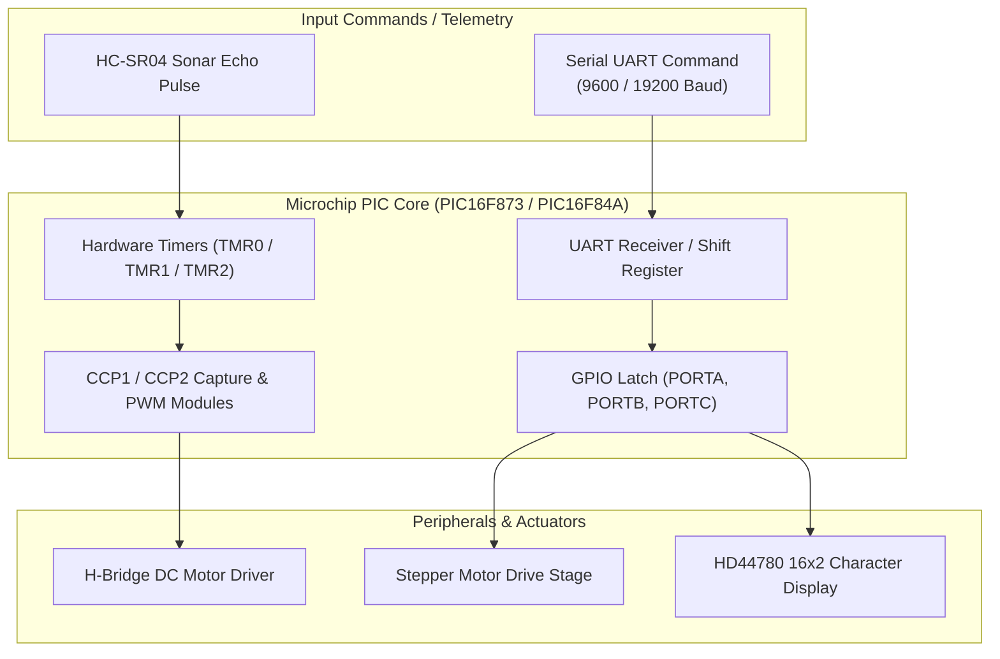

# Microchip PIC Microcontroller Firmware & Embedded Code Library

[-red?style=for-the-badge&logo=c)](https://github.com/HarryRogers073/pic-microcontroller-code)
[](https://www.microchip.com)
[](LICENSE)

> A modular embedded firmware repository housing **MPASM assembly routines** and **MPLAB XC8 embedded C drivers** for Microchip PIC microcontrollers, developed during engineering degree studies at the **University of Brighton**. Spans bare-metal Harvard architecture assembly, dynamic PWM pulse modulation, UART serial bus orchestration, and the autonomous mobile sensor buggy embedded C firmware.

---

### 📜 Academic Integrity & Attribution Disclosure
- **Author & Firmware Development:** Authored by **Harry Rogers** across embedded systems coursework at the University of Brighton, achieving an **84% Distinction Grade (A+)**.
- **Project Scope & Architecture:** 
  - The **MPASM Assembly Firmware** (`firmware_asm/`) is a low-level register-level implementation of dual-PIC master/slave UART communication and hardware Timer 2 PWM modulation.
  - The **Embedded C Drivers** (`firmware_c/`) were developed for the autonomous mobile sensor buggy platform (co-authored with Albie Gullis), implementing dual-screen I2C telemetry, ADC temperature sensing, and sonar collision avoidance. This autonomous sensor buggy is a separate project from the collegiate Robot Wars combat platform.
- **Third-Party & Vendor IP:** Microcontroller register definitions (`p16f873.inc`, `p16f84a.inc`, `<xc.h>`), processor configuration fuse directives, and standard peripheral initialization paradigms are copyright **Microchip Technology Inc.**

---

## 🎯 Architecture & Included Modules

### 1. MPASM Assembly Firmware (`firmware_asm/`)
Targeted to **PIC16F84A** and **PIC16F873** 8-bit Harvard architecture microcontrollers:
- **`16F873_RX_to_PWM.asm`:** Hardware UART command receiver coupled with timer-driven PWM generation for real-time actuator modulation.
- **`16F873_RX_to_LEDs_PORTC.ASM`:** Direct byte-level register latching and Port C bitfield status driving.
- **`PWM.asm` & `PWM_Simple.asm`:** Hardware Timer 2 (TMR2) and PR2 register period calculation for duty-cycle pulse width modulation.
- **`SimplePWMTest.asm`:** Automated bench verification loop for pulse width integrity checking.

### 2. Embedded C Drivers (`firmware_c/`)
Targeted to MPLAB XC8 compiler:
- **`MovementCode.c`:** Differential dual-motor drive controller with directional truth-table steering and speed throttling.
- **`ultrasonic_driver.c`:** Precision HC-SR04 sonar trigger generation and timer capture interrupt routines for distance ranging.
- **`stepper_actuator.c`:** 4-phase step-sequence indexing driver for high-torque stepper positioning.
- **`lcd.c`:** Hitachi HD44780 4-bit/8-bit parallel character LCD driver with string formatting and cursor addressing.

---

## 🏗️ Hardware Control Flow



---

## 📂 Repository Contents

```
pic-microcontroller-code/
├── firmware_asm/                          # Low-level MPASM assembly routines
│   ├── 16F873_RX_to_PWM.asm               # Serial command to PWM output
│   ├── 16F873_RX_to_LEDs_PORTC.ASM        # Port C register bit driver
│   ├── PWM.asm                            # Core hardware PWM generator
│   ├── PWM_Simple.asm                     # Simplified pulse generator
│   └── SimplePWMTest.asm                  # Bench test validation routine
├── firmware_c/                            # MPLAB XC8 embedded C drivers
│   ├── MovementCode.c                     # Differential DC motor drive routines
│   ├── ultrasonic_driver.c                # HC-SR04 ultrasonic echo timing
│   ├── stepper_actuator.c                 # Stepper motor phase sequencing
│   └── lcd.c                              # HD44780 LCD display driver
└── docs/
    └── PWM_LED_Flowchart_Diagram.png      # Firmware execution flowchart
```

---

## 🛠️ Compilation & Tooling Guide

### Assembling Assembly Files
1. Open **Microchip MPLAB X IDE**.
2. Create an **MPASM** project targeting the **PIC16F873** or **PIC16F84A**.
3. Add the desired `.asm` source file.
4. Build the project and program using a **PICkit 3 / 4** in-circuit debugger.

### Compiling C Firmware
1. In MPLAB X, create an **Application Project** targeting the PIC microcontroller.
2. Select the **Microchip XC8 C Compiler**.
3. Add the `.c` source files and headers to the project tree.
4. Compile the project and inspect memory allocation in the Dashboard.

---

## 🎓 Academic Attribution

- **Author:** Harry Rogers
- **Degree:** BEng (Hons) Electronic & Computer Engineering (First-Class Honours)
- **Institution:** University of Brighton
- **Modules:** EO631 (Embedded Systems 3) & EO524 (Embedded Systems)
- **Portfolio:** [www.harry-rogers.com](https://www.harry-rogers.com)

---

## 📄 License
This repository is licensed under the MIT License - see [LICENSE](LICENSE) for details.
