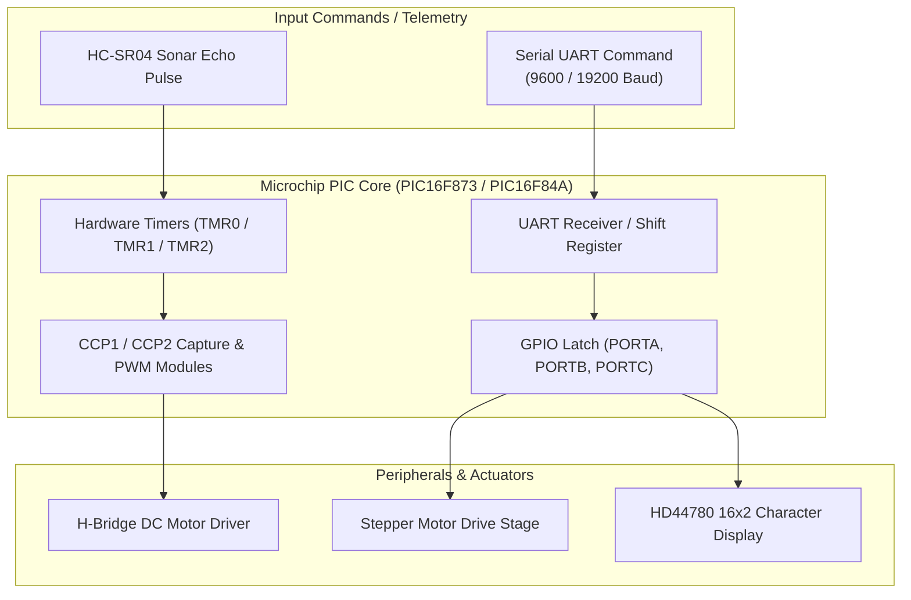

# Microchip PIC Microcontroller Firmware & Embedded Code Library

[-red?style=for-the-badge&logo=c)](https://github.com/HarryRogers073/pic-microcontroller-code)
[](https://www.microchip.com)
[](LICENSE)

> A modular embedded firmware repository housing **MPASM assembly routines** and **MPLAB XC8 embedded C drivers** for Microchip PIC microcontrollers, developed during engineering degree studies at the **University of Brighton** (Grade: **84% Distinction / A+**). It includes bare-metal Harvard architecture assembly for PWM and UART reception, alongside embedded C drivers for the autonomous mobile sensor buggy.

---

### ◆ Academic Integrity & Attribution Disclosure
- **Author & Firmware Development:** Authored by **Harry Rogers** across embedded systems coursework at the University of Brighton.
- **Repository Scope & Attribution Breakdown:**
  - **`firmware_asm/` (Bare-Metal MPASM Assembly):** Authored entirely by Harry Rogers. Contains register-level assembly routines for hardware Timer 2 PWM generation, interrupt-on-change radio signal decoding, and direct Port C diagnostic latching on the PIC16F873 and PIC16F84A.
  - **`firmware_c/` (Embedded C Drivers):** Developed for the autonomous corridor-navigating sensor buggy platform in collaboration with Albie Gullis. Contains differential steering logic, stepper actuation, and HC-SR04 ultrasonic echo timing.
  - **Adapted Third-Party Code:** The character LCD driver (`firmware_c/lcd.c`) is an I2C implementation adapted from a tutorial by Khaled Magdy (DeepBlueEmbedded) by team member Kay Hendriksen and modified for a 16 MHz clock.
- **Third-Party & Vendor IP:** Microcontroller register definitions (`p16f873.inc`, `p16f84a.inc`, `<xc.h>`), processor configuration directives, and peripheral initialisation parameters are copyright **Microchip Technology Inc.**

---

## ★ Repository Architecture

### 1. MPASM Assembly Firmware (`firmware_asm/`)
Targeted to **PIC16F84A** and **PIC16F873** 8-bit Harvard architecture microcontrollers:
- **`16F873_RX_to_PWM.asm`:** Hardware UART / radio receiver pulse decoder using Timer0 interrupt capture to modulate CCP1 PWM duty cycles.
- **`16F873_RX_to_LEDs_PORTC.ASM`:** Direct byte-level register latching and Port C status driving.
- **`PWM.asm` & `PWM_Simple.asm`:** Hardware Timer 2 (TMR2) and PR2 register period calculation for duty-cycle pulse width modulation.
- **`SimplePWMTest.asm`:** Automated bench verification loop for pulse width integrity checking.

### 2. Embedded C Drivers (`firmware_c/`)
Targeted to MPLAB XC8 compiler:
- **`MovementCode.c`:** Differential dual-motor drive controller with directional truth-table steering and speed scaling.
- **`ultrasonic_driver.c`:** HC-SR04 sonar trigger generation and timer capture interrupt routines for distance ranging.
- **`stepper_actuator.c`:** 4-phase step-sequence indexing driver for unipolar stepper positioning.
- **`lcd.c`:** I2C-based HD44780 character LCD driver with string formatting and cursor addressing (adapted from DeepBlueEmbedded).

---

## ◆ Hardware Control Flow



---

## ◆ Repository Structure

```text
pic-microcontroller-code/
├── firmware_asm/                   # Bare-Metal MPASM Assembly (Harry Rogers)
│   ├── 16F873_RX_to_PWM.asm        # Receiver pulse decode to PWM
│   ├── 16F873_RX_to_LEDs_PORTC.ASM # Port C LED diagnostic latching
│   ├── PWM.asm                     # CCP1 / Timer 2 hardware PWM
│   ├── PWM_Simple.asm              # Direct pulse to PWM conversion
│   └── SimplePWMTest.asm           # Automated bench verification loop
├── firmware_c/                     # Embedded C Drivers (Harry Rogers & Albie Gullis)
│   ├── MovementCode.c              # Differential motor drive controller
│   ├── ultrasonic_driver.c         # Ultrasonic sonar echo capture
│   ├── stepper_actuator.c          # Stepper motor driver
│   └── lcd.c                       # I2C HD44780 LCD driver (Adapted from DeepBlueEmbedded)
└── docs/                           # Hardware diagrams and documentation
    └── PWM_LED_Flowchart_Diagram.png
```

---

## → Compilation & Flashing Guide

### Assembling MPASM Files in MPLAB X
1. Open **MPLAB X IDE**.
2. Create an **MPASM** standalone project targeting **PIC16F873** or **PIC16F84A**.
3. Add the desired `.asm` file from `firmware_asm/`.
4. Build the project to generate the production `.hex` file.
5. Flash onto physical silicon using a **PICkit 3** or **PICkit 4** programmer.

### Compiling Embedded C in MPLAB XC8
1. Create a project targeting the PIC16F microcontroller with the **XC8** toolchain.
2. Add files from `firmware_c/`.
3. Set the oscillator frequency define (`#define _XTAL_FREQ 4000000` or `16000000` depending on your crystal).
4. Build and program the target board.

---

## ★ Academic Information & Author

- **Author:** Harry Rogers
- **Collaborator (Buggy C Firmware):** Albie Gullis
- **Degree:** BEng (Hons) Electronic & Computer Engineering (First-Class Honours)
- **Institution:** University of Brighton
- **Context:** Embedded Systems Engineering Coursework (Grade: 84% / A+)
- **Website:** [www.harry-rogers.com](https://www.harry-rogers.com)
- **LinkedIn:** [linkedin.com/in/harryrogers073](https://www.linkedin.com/in/harryrogers073/)

---

## ◆ License
This repository is licensed under the MIT License - see [LICENSE](LICENSE) for details. Microchip register definitions and include files remain the property of Microchip Technology Inc.
